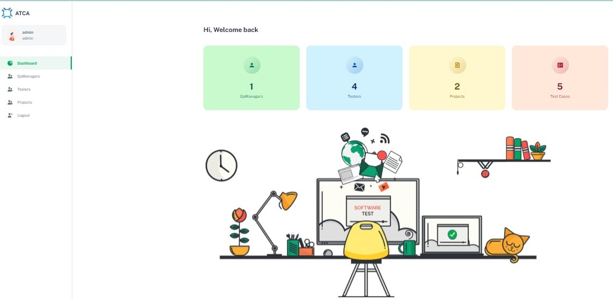

# Automated Test Case Allocation
## How To Install?
1. `git clone https://github.com/King-Fisher-San/ATCA-FrontEnd`
2. `cd ATCA-FrontEnd`
3. `npm i --legacy-peers-`
4. `npm run start`

## Screenshots

## How To Deploy?

1. Make an account on Heroku and create a project.
2. Run the command: `git remote add heroku <URL>`
3. Run the command: `git push heroku main`